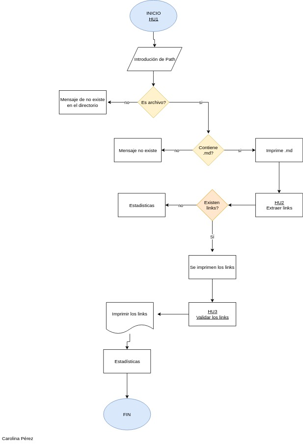
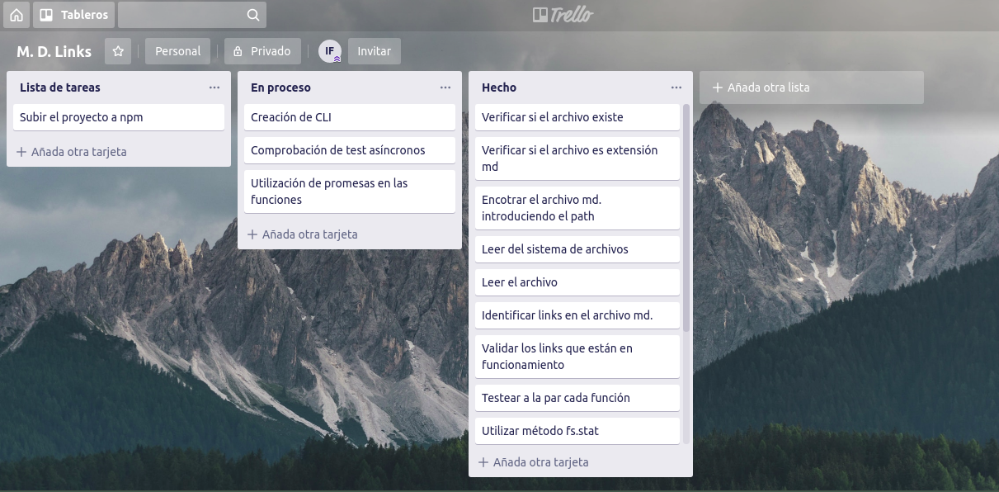

# Markdown Links

[Markdown](https://es.wikipedia.org/wiki/Markdown) es un lenguaje de marcado
ligero muy popular entre developers. Es usado en muchísimas plataformas que
manejan texto plano (GitHub, foros, blogs, ...), y es muy común
encontrar varios archivos en ese formato en cualquier tipo de repositorio
(empezando por el tradicional `README.md`).

Estos archivos `Markdown` normalmente contienen _links_ (vínculos/ligas) que
muchas veces están rotos o ya no son válidos y eso perjudica mucho el valor de
la información que se quiere compartir.

Tópicos:

- [Node.js](https://nodejs.org/en/).
- [módulos (CommonJS)](https://nodejs.org/docs/latest-v0.10.x/api/modules.html).
- [file system](https://nodejs.org/api/fs.html).
- [path](https://nodejs.org/api/path.html).
- [http.get](https://nodejs.org/api/http.html#http_http_get_options_callback).
- [Parsing](https://en.wikipedia.org/wiki/Parsing).
- [markdown](https://daringfireball.net/projects/markdown/syntax).
- [CLI](https://www.proyectobyte.com/windows/simbolo-del-sistema/uso-la-interfaz-linea-comandos).
- [npm-scripts](https://docs.npmjs.com/misc/scripts).
- [semver](https://semver.org/).

## Diagrama de flujo del proceso

## Herramientas de desarrollo
